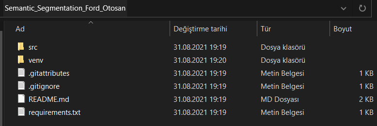
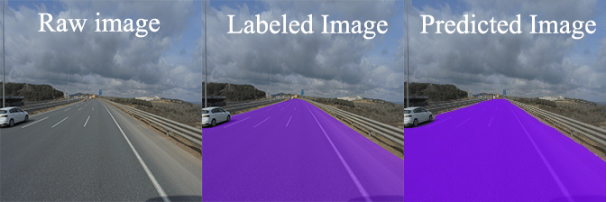
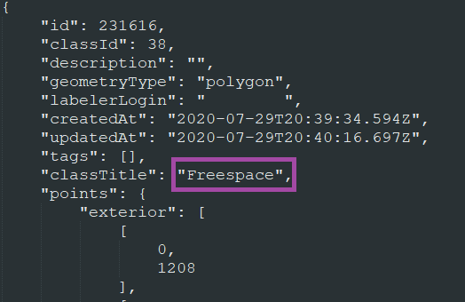
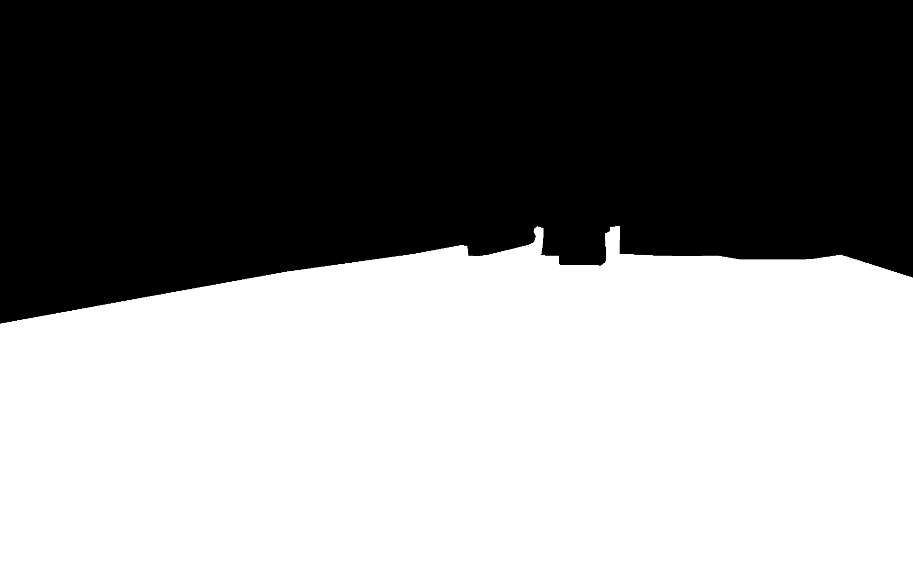
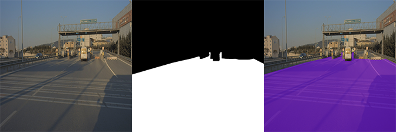

# **Build**
1. ## **Installation**

    In order to clone the repository to your local computer open command prompt or terminal and run the command given below.
    ```bash
    git clone https://github.com/MrAlbino/Semantic_Segmentation_Ford_Otosan.git
    ```
&nbsp;

2. ## **Creating Virtual Environment (Optional)**
    > You have to be in the root directory for these commands.
    * ### **For Windows**:
      * Create Virtual Environment:

        ```bash
        python -m venv venv
        ``` 
       * Activate Virtual Environment:

            ```bash
            venv\Scripts\activate.bat
            ```
        * Deactivate Virtual Environment:

            ```bash
            deactivate
            ```
    * ### **For Linux**:
        * Create Virtual Environment:

            ```bash
            python3 -m venv venv
            ``` 
       * Activate Virtual Environment:

            ```bash
            source venv/bin/activate
            ```
        * Deactivate Virtual Environment:

            ```bash
            deactivate
            ```
    > After all these processes the expected folder hierarcy can be seen below.

     * **Expected Hierarcy**:
         
        


&nbsp;

3. ## **Install Required Libraries**
   * Virtual environment must be activated before running this command.
  
        ```bash
        pip install -r requirements.txt
        ``` 
    &nbsp;
--- 
&nbsp;
# **Explanation**

1. ## **Purpose**
    Our main purpose in this project is to detecting driveable areas for autonomous vehicles.

&nbsp;

2. ## **Expected Result:**

   
&nbsp;
. ## **Create Mask with Json**
   
   >This is the explanation of [json2mask.py](/src/json2mask.py)

   In this part of the project, we will use the json files that created after the image labeling process to obtain masks. These files contain information of the freespace class exterior point location. You can see an example of the json file format below.
   

   

    With those informations we can now draw the mask of the freespace.
     ```bash
     if obj['classTitle']=='Freespace':
            mask = cv2.fillPoly(mask, np.array([obj['points']['exterior']]), color=1)
     ```  
     The code block you can see above, determines which object  has "Freespace" as a classTitle. After that it draws mask using __fillPoly__ function from cv2 library.

     ### **Expected Mask Format:**

    
&nbsp;

3. ## **Colorize and Test Masks**
   >This is the explanation of [mask_on_image.py](/src/mask_on_image.py)

   We are ready to test our masks now. In this part we will apply our mask on raw image and then applying some colors too. So we can check, is our mask ready to go ?
   
   **See transaction visualization below, left-to-right:**

   

   As you can see our masks are working fine, we can continue.

4. ## **Preprocess**
   >This is the explanation of [preprocess.py](/src/preprocess.py)

   In this section we will use our masks and images as inputs to the model. Before that we have to convert these inputs to the tensor format because our model will be expecting tensor formatted inputs.
   ```bash
    def torchlike_data(data):
        n_channels = data.shape[2]
        torchlike_data=np.empty((n_channels,data.shape[0],data.shape[1]))
        for ch in range(n_channels):
            torchlike_data[ch] = data[:,:,ch]
        return torchlike_data
   ```
   ***torchlike_data(data)*** function takes an input(image) and returns torch like data. We use this function inside the ***tensorize_image()*** and ***tensorize_mask()*** methods.

   Inside the ***tensorize_mask()*** function, procedure works same as ***tensorize_image()*** but there is an addition named ***one_hot_encoder()*** method you can see below.

    ```bash
    def one_hot_encoder(data, n_class):
        encoded_data = np.zeros((*data.shape, n_class), dtype=np.int)

        encoded_labels = [[0,1], [1,0]]
        for lbl in range(n_class):

            encoded_label = encoded_labels[lbl]
            numerical_class_inds = data[:,:] == lbl
            encoded_data[numerical_class_inds] = encoded_label
        return encoded_data
    ```

    One hot encoding stands for classifying categorical data. One hot encoding transforms our categorical labels into vectors of ones and zeros. Length of these vectors depends on the number of categories, in this example we have 2 categories; ***driveable area***, ***undriveable area***. Elements of these vectors are zeros except for the element that corresponds to the __driveable are__, this element will be one (1).  

    There is another function named ___image_mask_check()___, it takes inputs images and masks path and checks if they match or not. If they don't match we can not use them.
    ```bash
    def image_mask_check(image_path_list, mask_path_list):
        for image_path, mask_path in zip(image_path_list, mask_path_list):
            image_name = image_path.split('/')[-1].split('.')[0]
            mask_name  = mask_path.split('/')[-1].split('.')[0]
            assert image_name == mask_name, "Image and mask name does not match {} - {}".format(image_name, mask_name)
    ```

5. ## **Model**

    >This is the explanation of [model.py](/src/model.py)

    

